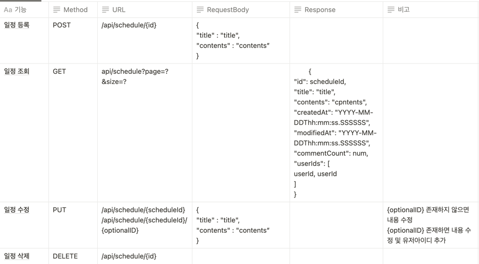
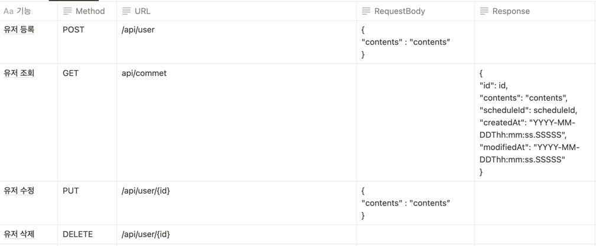
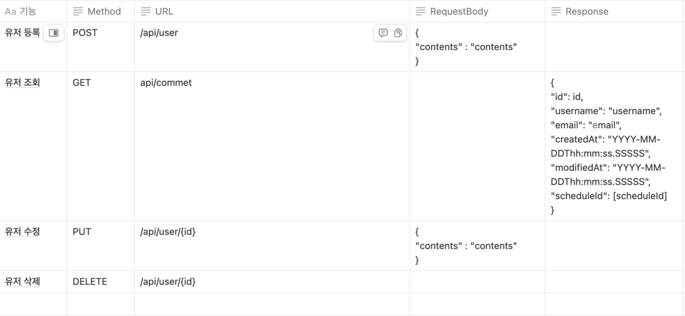

# **1. API명세 작성**
### **일정API**

### **댓글API**

### **유저API**

# **2. ERD 작성**

# **3. 프로젝트 소개**
### Lv 0. API 명세 및 ERD 작성   `필수`
## 3️⃣ 필수 기능 가이드

- [x]  **API 명세서 작성하기**
    - [x]  API명세서는 프로젝트 root(최상위) 경로의 `README.md` 에 작성
    - 참고) API 명세서 작성 가이드
        - API 명세서란 API명, 요청 값(파라미터), 반환 값, 인증/인가 방식, 데이터 및 전달 형식 등 API를 정확하게 호출하고 그 결과를 명확하게 해석하는데 필요한 정보들을 일관된 형식으로 기술한 것을 의미합니다.
        - request 및 response는 [json(링크)](https://namu.wiki/w/JSON) 형태로 작성합니다.

- [x]  **ERD 작성하기**
    - [x]  ERD는 프로젝트 root(최상위) 경로의 `README.md` 에 첨부
        - API 명세 작성을 통해 서비스의 큰 흐름과 기능을 파악 하셨다면 이제는 기능을 구현하기 위해 필요한 데이터가 무엇인지 생각해봐야합니다.
            - 이때, 구현해야 할 서비스의 영역별로 필요한 데이터를 설계하고 각 영역간의 관계를 표현하는 방법이 있는데 이를 ERD(Entity Relationship Diagram)라 부릅니다.
        - ERD 작성간에 다음과 같은 항목들을 학습합니다.
            - E(Entity. 개체)
                - 구현 할 서비스의 영역에서 필요로 하는 데이터를 담을 개체를 의미합니다.
                    - ex) `책`, `저자`, `독자`, `리뷰`
            - A(Attribute. 속성)
                - 각 개체가 가지는 속성을 의미합니다.
                    - ex) 책은 `제목`, `언어`, `출판일`, `저자`, `가격` 등의 속성을 가질 수 있습니다.
            - R(Relationship. 관계)
                - 개체들 사이의 관계를 정의합니다.
                    - ex) `저자`는 여러 권의 `책`을 집필할 수 있습니다. 이때, 저자와 책의 관계는 일대다(1:N) 관계입니다.

- [x]  **SQL 작성하기**
    - [x]  설치한 데이터베이스(Mysql)에 ERD를 따라 테이블을 생성
    - 참고) SQL 작성 가이드
        - 과제 프로그램의 root(최상위) 경로에`schedule.sql` 파일을 만들고, 테이블 생성에 필요한 query를 작성하세요.

### Lv 1. 일정 CRUD  `필수`

- 키워드

  **어노테이션**

    - `@Entity`: 데이터베이스 테이블과 매핑되는 클래스에 사용합니다.
    - `@Id`: 해당 필드를 기본 키로 지정합니다.
    - `@GeneratedValue`: 기본 키 생성 전략을 설정합니다.
    - `@Repository`: DAO(Data Access Object) 클래스에 사용하여 데이터 접근을 명시합니다.
- [x]  일정을 저장, 조회, 수정, 삭제할 수 있습니다.
- [x]  일정은 아래 필드를 가집니다.
    - [x]  `작성 유저명`, `할일 제목`, `할일 내용`, `작성일`, `수정일` 필드 → `2주차 13 JPA Auditing`
- [x]  삭제의 경우
    - [x]  일정을 삭제할 때 일정의 댓글도 함께 삭제
    - [x]  이 때, JPA의 영속성 전이 기능을 활용 → `4주차 12 영속성 전이`

### Lv 2. 댓글 CRUD  `필수`

- 키워드

  **어노테이션**

    - `@Entity`: 데이터베이스 테이블과 매핑되는 클래스에 사용합니다.
    - `@Id`: 해당 필드를 기본 키로 지정합니다.
    - `@GeneratedValue`: 기본 키 생성 전략을 설정합니다.
    - `@Repository`: DAO(Data Access Object) 클래스에 사용하여 데이터 접근을 명시합니다.
    - `@ManyToOne`: 일정 엔티티와 댓글 엔티티간의 연간관계를 설정 합니다.→`4주차 08. N대 1 관계`
- [x]  기 생성한 일정에 댓글을 남길 수 있습니다.
    - [x]  댓글과 일정은 연관관계를 가집니다.
- [x]  댓글을 저장, 조회, 수정, 삭제할 수 있습니다.
- [x]  댓글은 아래와 같은 필드를 가집니다.
    - [x]  `댓글 내용`, `작성일`, `수정일`, `작성 유저명` 필드 → `2주차 13. JPA Auditing`

### Lv 3. 일정 페이징 조회  `필수`

- 키워드

  **데이터베이스**

    - offset / limit : SELECT 쿼리에 적용해서 데이터를 제한 범위에 맞게 조회할 수 있습니다.

  **페이징**

    - Pageable : Spring Data JPA에서 제공되는 페이징 관련 인터페이스 입니다.
    - PageRequest : Spring Data JPA에서 제공되는 페이지 요청 관련 클래스입니다.
- [x]  일정을 Spring Data JPA의 `Pageable`과 `Page` 인터페이스를 활용하여 페이지네이션을 구현
    - [x]  `페이지 번호`와 `페이지 크기`를 쿼리 파라미터로 전달하여 요청하는 항목을 나타냅니다.
    - [x]  `할일 제목`, `할일 내용`, `댓글 개수`, `일정 작성일`, `일정 수정일`, `일정 작성 유저명` 필드를 조회합니다.
    - [x]  디폴트 `페이지 크기`는 10으로 적용합니다.
- [x]  일정의 `수정일`을 기준으로 내림차순 정렬합니다.

### Lv 4. 유저 CRUD  `필수`

- 키워드

  **어노테이션**

    - `@Entity`: 데이터베이스 테이블과 매핑되는 클래스에 사용합니다.
    - `@Id`: 해당 필드를 기본 키로 지정합니다.
    - `@GeneratedValue`: 기본 키 생성 전략을 설정합니다.
    - `@Repository`: DAO(Data Access Object) 클래스에 사용하여 데이터 접근을 명시합니다.
    - @ManyToOne: 유저 테이블과 일정 테이블간 연간관계를 설정 합니다.
    - @OneToMany: 유저 테이블과 일정 테이블간 연간관계를 설정 합니다.
    - 지연로딩 : 객체가 조회될 때 연관된 객체를 한번에 조회 하지 않습니다.
- [x]  유저를 저장, 조회, 삭제할 수 있습니다.
- [x]  유저는 아래와 같은 필드를 가집니다.
    - [x]  `유저명`, `이메일`, `작성일`, `수정일` 필드
- [x]  일정은 이제 `작성 유저명` 필드 대신  유저테이블의 id필드를 가집니다.
- [x]  일정을 작성한 유저는 추가로 일정 담당 유저들을 배치할 수 있습니다.
    - [x]  유저와 일정은 N:M 관계입니다. → `4주차 10. N 대 M 관계`
    - [x]  JPA 지연로딩을 활용합니다. (EAGER → LAZY) → `4주차 11. 지연 로딩`

### Lv 5. 다양한 예외처리 적용하기  `필수`

- 키워드

  **어노테이션**

    - @Valid : 객체의 제약 조건을 검증합니다.
    - 아래 다양한 어노테이션을 최대한 활용해보도록 합니다.

  | @NotNull | null 불가 |
      | --- | --- |
  | @NotEmpty | null, “” 불가 |
  | @NotBlank | null, “”. “ “ 불가 |
  | @Size | 문자 길이 측정 |
  | @Max | 최대값 |
  | @Min | 최소값 |
  | @Positive | 양수 |
  | @Negative | 음수 |
  | @Email | E-mail 형식 |
  | @Pattern | 정규 표현식 |
- [x]  validation을 활용해 다양한 예외처리를 적용해 봅니다. → `3주차 14. Validation`
- [x]  정해진 예외처리 항목이 있는것이 아닌 프로젝트를 분석하고 예외사항을 지정해 봅니다.
    - [x]  Ex) 할일 제목은 10글자 이내, 유저명은 4글자 이내
    - [x]  @Pattern을 사용해서 회원 가입 Email 데이터 검증 등 → `3주차 숙제`
        - [x]  정규표현식을 적용하되, 정규표현식을 어떻게 쓰는지 몰두하지 말 것!
        - [x]  검색해서 나오는 것을 적용하는 것으로 충분!

## 4️⃣ 도전 기능 가이드

- 목표 : JWT를 활용한 로그인/회원가입 구현하기
    - 3주차(숙련 1주차)09. 필터까지 숙지하면 시도할 수 있어요!

### Lv 1. 회원가입(JWT)  `도전`
- [ ]  유저에 `비밀번호` 필드를 추가합니다.
    - [ ]  비밀번호는 암호화되어야 합니다.
    - [ ]  암호화를 위한 `PasswordEncoder`를 직접 만들어 사용합니다.
- [ ]  유저 최초 생성(회원가입) 시 JWT를 발급 후 반환 → `3주차 05. JWT란 무엇일까?` 부터 `필터`까지

### Lv 2. 로그인(인증)  `도전`

- 키워드

  **인터페이스**

    - HttpServletRequest / HttpServletResponse : 각 HTTP 요청에서 주고받는 값들을 담고 있습니다.
- [ ]  **설명**
    - [ ]  JWT를 활용해 로그인 기능을 구현합니다. → 3주차 09 필터
    - [ ]  필터를 활용해 인증 처리를 할 수 있습니다.
- [ ]  **조건**
    - [ ]  `이메일`과 `비밀번호`를 활용해 로그인 기능을 구현합니다.
        - [ ]  로그인 성공 시 JWT  발급 후 반환합니다.
    - [ ]  모든 요청에서 토큰을 활용하여 인증 처리를 합니다.
        - [ ]  토큰은 `Header`에 추가합니다.
    - [ ]  회원가입과 로그인은 인증 처리에서 제외합니다.
- [ ]  **예외처리**
    - [ ]  로그인 시 이메일과 비밀번호가 일치하지 않을 경우 401을 반환합니다.
    - [ ]  토큰이 없는 경우 400을 반환합니다.
    - [ ]  유효 기간이 만료된 토큰의 경우 401을 반환합니다.

### Lv 3. 권한 확인(인가)  `도전`

- 키워드

  **JWT**

    - Claim / payload :  JWT 내부에 정보를 저장할 수 있는 공간입니다.

  Filter

    - Filter :  요청이 전달되기 전/후에 url 패턴에 맞는 모든 요청에 대해 부가작업을 처리
- [ ]  조건
    - [ ]  유저에 `권한`을 추가합니다.
        - [ ]  권한은 `관리자`, `일반 사용자` 두 가지가 존재합니다.
        - [ ]  JWT를 발급할 때 유저의 권한 정보를 함께 넣어줍니다.
    - [ ]  일정 수정 및 삭제는 `관리자` 권한이 있는 유저만 할 수 있습니다.
- [ ]  예외처리
    - [ ]  권한이 없는 유저의 경우 403을 반환합니다. —> 권한이 없는 유저가 일정 수정 및 삭제를 요청했을 때

### Lv 4. 외부 API 조회  `도전`

- 키워드

  외부 API 연동

    - RestTemplate / WebClient ****:  외부 API와 연동을 위한 Spring 제공 클래스입니다.
- [ ]  조건
    - [ ]  [**날씨 정보 데이터(링크)**](https://f-api.github.io/f-api/weather.json) API를 활용하여 오늘의 날씨를 조회할 수 있습니다.
        - [ ]  `RestTemplate`을 사용해 날씨를 조회합니다.
    - [ ]  일정에 `날씨` 필드를 추가합니다.
        - [ ]  일정 생성 시에 날씨 정보를 생성일 기준으로 저장할 수 있습니다.